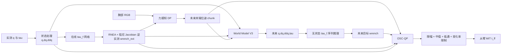

# DP、World Model V3 与 Nero OSC-QP 当前实现总结

本文基于 2026-07-31 工作区中的实际代码与配置，梳理三部分当前实现：

1. `diffusion_policy` 的力感知 Diffusion Policy（DP）；
2. `PINN` 中的确定性 World Model V3（下文简称 WM V3）；
3. `nero_ws` 中把 DP、WM V3 和 OSC-QP 串起来的在线控制系统。

重点是网络结构、张量接口、训练流、在线推理流和模块之间的连接关系。本文描述的是当前工作树，不等同于三个仓库远端分支中已经提交的内容。

## 1. 代码快照与实现状态

| 模块 | 当前 Git 状态 | 本文采用的实现 |
|---|---|---|
| DP | `V` 分支 | `ForceAwareDiffusionTransformerPolicy` |
| PINN | 实际 Git 分支是 `master`，不存在名为 `wm` 的本地/远端分支；WM V3 主要是未提交文件 | `DeterministicWorldModelV3`、`WorldModelV3Loss`、`WorldModelV3Trainer` |
| Nero | `master`，`inference/` 和多项测试仍是未提交内容 | `NeroInferencePipeline`、`WorldModelWrenchAdapter`、`OSCQPController` |

因此，当前所谓“PINN 的 wm 分支”在磁盘上对应的是 `PINN/master` 工作树中的 WM V3 未提交实现，而不是一个真实的 Git branch。复制、切换分支或清理工作树前必须先提交这些文件，否则实现会丢失。

## 2. 系统总览



系统本质上是三层：

- DP 负责从视觉和接触历史产生“想去哪里”的末端位姿轨迹；
- WM V3 负责在该动作条件下预测机器人未来状态，再通过 Nero 物理链得到“预计会产生什么接触力”；
- OSC-QP 同时跟踪位姿与接触力，并在关节、速度、力矩和 wrench 约束内求出 7 维关节力矩。

## 3. 关键张量接口

| 阶段 | 输入 | 输出 |
|---|---|---|
| DP | RGB `[B,2,3,192,256]`；wrench 历史 `[B,2,8,6]` | 8 步原始动作预测 `[B,8,7]`；执行 chunk `[B,7,7]`；均值目标 `[B,7]` |
| WM V3 | 50 步历史 `q/v/a/tau: [B,50,7]`、wrench `[B,50,6]`；20 步 future action `[B,20,7]` | future `q/v/a/tau`，每项 `[B,20,7]` |
| WM wrench adapter | 历史状态 `[50,7]`；预测状态 `[20,7]` | future wrench `[20,6]` |
| OSC-QP | 当前 `q,dq: [7]`；目标 pose `[10,4,4]`；目标/实测 wrench | 未来 `tau: [10,7]`，只执行第一步 `[7]` |

当前 DP chunk 只有 7 步，而 WM 需要 20 步、QP 需要 10 步。在线代码的对齐规则是：

- DP action 少于 20 步时，用最后一个 action 尾部保持，补齐给 WM；
- DP action 给 QP 时补齐/截断为 10 步；
- WM 输出 20 步 wrench，给 QP 时截取前 10 步。

## 4. 力感知 Diffusion Policy

### 4.1 输入与任务定义

当前任务配置使用：

- 两个观测时刻 `n_obs_steps=2`；
- 每个观测时刻一张腕部图像 `3×192×256`；
- 每个观测时刻包含 8 个高频六维 wrench 样本；
- action 是 7 维绝对末端位姿 `[x,y,z,qx,qy,qz,qw]`；
- 扩散 horizon 为 8，实际选取索引 `1..7`，形成 7 步 action chunk；
- 当前 `relative_pose_actions=false`，训练和输出都是绝对位姿。

### 4.2 视觉—力观测编码器

```text
每个观测时刻：

RGB 192×256
  -> DINOv3（冻结）
  -> 去掉 CLS/register，只保留 patch tokens
  -> Linear(DINO hidden -> 256)
  -> image tokens

8×6 wrench history
  -> Linear(6 -> 256)
  -> 1-layer GRU(256)
  -> 8 个 force query tokens

force query --cross attention--> image patch key/value
  -> residual + FFN(256 -> 1024 -> 256)
  -> 8 个融合 token
```

网络细节：

- DINO 模型由 checkpoint/config 中的路径决定；仓库 fallback 是 DINOv3 ViT-S/16，当前服务器训练显式使用 ViT-B/16；
- DINO backbone 参数冻结并始终保持 `eval()`，但每个 batch 仍执行前向计算；
- 图像 token、wrench token、观测时刻分别有可学习的 modality/position embedding；
- wrench temporal encoder 当前是单层 GRU，也支持 LSTM、Transformer 或 Identity；
- cross-attention 以 8 个 wrench token 为 query，以全部图像 patch 为 key/value；
- 最终不把所有视觉 patch 直接送给动作网络，而是每个观测只输出 8 个视觉增强后的 wrench token；
- 两个观测时刻最终得到 `2×8=16` 个 256 维 context token。

### 4.3 接触感知 curriculum

训练时先在物理单位下计算 `Fx/Fy/Fz` 的模长，并对每个 8 点历史取均值。当前阈值是 `2 N`。

当最新观测判定为接触时，以随 optimizer step 变化的概率屏蔽图像 token：

- scope 为 `full_context`，即一次屏蔽该样本两个观测时刻的所有图像；
- 概率从 step 0 的 `1.0` 按 cosine 降到 step 50000 的 `0.0`；
- 当前总训练步数是 40000，因此训练结束前概率尚未完全归零；
- 推理时不做图像屏蔽。

这个 curriculum 的目的，是让模型在训练早期接触阶段更依赖 wrench，随后逐渐恢复完整视觉条件。

### 4.4 动作扩散网络

动作去噪器是 `ContextTransformerForDiffusion`：

- action token：`Linear(7 -> 256)` 加 8 步可学习位置编码；
- diffusion timestep：sinusoidal embedding，作为一个独立 time token；
- condition memory：`time token + 16 个观测 context token`；
- condition encoder：1 层 Transformer Encoder，4 heads，FFN 1024；
- action decoder：8 层 Transformer Decoder，4 heads，FFN 1024；
- 当前 `causal_attn=false`，8 个动作位置可双向自注意；
- 输出头：`LayerNorm + Linear(256 -> 7)`，预测 epsilon。

### 4.5 DP 训练流

```text
LeRobotV3 sample
  -> RGB 解码/增强，wrench/action 对齐
  -> action 与 wrench 归一化
  -> 接触检测与图像 curriculum mask
  -> DINO + wrench GRU + cross-attention
  -> 得到 context
  -> 随机采样 diffusion timestep 和 Gaussian noise
  -> 给 action 加噪
  -> Transformer 预测 epsilon
  -> MSE(predicted epsilon, sampled noise)
  -> AdamW + gradient clip + EMA
```

当前主要训练参数是 batch 192、AdamW `1e-4`、warmup 500、cosine LR、40000 optimizer steps、每 5000 步保存 checkpoint。动作网络 weight decay 为 `1e-3`，观测融合模块为 `1e-6`。

### 4.6 DP 推理流

推理从 Gaussian action trajectory 开始，使用 DDIM 从 100 个训练噪声时间步中执行 8 次反向采样。反归一化后统一四元数，跳过索引 0 的 prestep，再取动作索引 `1..8`。

策略同时返回：

- `action`：去掉 prestep 后的 8 步 future chunk，Nero 用它按序跟踪并条件化 WM；
- `action_pred`：包含 prestep 的完整 9 步绝对动作；
- `model_action_pred`：模型动作空间中的完整 9 步预测，相对动作模式下用于训练和离线评估。

## 5. PINN World Model V3

### 5.1 建模目标

WM V3 是动作条件下的确定性低维世界模型：

```text
历史 50 步 q,v,a,tau,wrench + 未来 20 步 action
  -> 未来 20 步 q,v,a,tau
```

未来 wrench 标签只在训练时定义 force latent 的目标并提供物理监督。部署时不会直接使用网络内部的 `generated_wrench_internal`，而是用预测状态重新经过 Nero 的逆动力学、tau_f 和 Jacobian 映射得到 future wrench。

### 5.2 条件编码器

历史状态先按时间拼接：

```text
[q(7), v(7), a(7), tau(7)] = 28D
  -> LayerNorm(28)
  -> Linear(28 -> 128) + SiLU
  -> 2-layer GRU(128)
  -> state hidden 128D
```

未来动作编码：

```text
future absolute pose 7D
  -> LayerNorm(7)
  -> Linear(7 -> 128) + SiLU
  -> 2-layer GRU(128)
  -> action hidden 128D + 20 步 action features
```

两个最终 hidden 拼接后经 MLP 得到条件向量：

```text
[state hidden, action hidden] 256D
  -> Linear(256 -> 128) + SiLU
  -> Linear(128 -> 128)
  -> condition c
```

### 5.3 Force-to-Force Flow Matching

历史和未来 wrench 使用同一个 force encoder：

```text
wrench 6D
  -> LayerNorm(6)
  -> Linear(6 -> 128) + SiLU
  -> 2-layer GRU(128)
  -> LayerNorm + Linear(128 -> latent 128)
```

由此得到：

\[
z_0=E_f(w_{history}), \qquad z_1=E_f(w_{future}).
\]

训练时沿直线路径随机采样连续时间：

\[
z_t=(1-t)z_0+t z_1, \qquad v^*=z_1-z_0.
\]

time embedding 使用 `[t,sin(πt),cos(πt),sin(2πt),cos(2πt)]`，再通过两层 MLP 映射到 128 维。vector field 的结构是：

```text
[latent 128, condition 128, time 128] = 384D
  -> LayerNorm
  -> Linear(384 -> 256) + SiLU + Dropout
  -> Linear(256 -> 128) + SiLU
  -> Linear(128 -> latent velocity 128)
```

当前 `source_noise_std=0`，所以历史 wrench latent 是确定性起点。部署默认只做一次 Euler 积分：

\[
\hat z_1=z_0+v_\theta(z_0,0,c).
\]

### 5.4 联合未来状态解码器

每个未来时刻使用一个可学习 query，并拼接 action feature、condition 和生成后的 force latent：

```text
[query 128, action feature 128, condition 128, latent 128] = 512D
  -> Linear(512 -> 128) + SiLU
  -> 2-layer GRU(128)
  -> LayerNorm
  -> Linear(128 -> 128) + SiLU + Dropout
  -> Linear(128 -> 28)
  -> split 为 q/v/a/tau，各 7D
```

GRU 初始 hidden 由 `[condition, latent]` 经过 Linear 生成。四种状态共享时序 decoder 和联合 head 的隐藏表示，并不是四个独立网络。

另有两个只用于训练正则的 force decoder，分别将历史/未来 latent 解码为 wrench 序列。每个 decoder 使用 learned time query、2 层 GRU 和 6 维输出头。

### 5.5 WM V3 训练损失

当前源码默认总损失包含：

| 损失 | 当前源码权重 | 作用 |
|---|---:|---|
| Flow velocity MSE | 1.0 | 学习 `z0 -> z1` 的条件向量场 |
| 历史/未来 force latent 重建 L1 | 0.25 | 防止 force latent 坍缩 |
| 生成 latent 与目标 latent 一致性 L1 | 1.0 | 缩小训练/推理 gap |
| 生成 latent 的 future wrench 重建 L1 | 0.25 | 约束实际积分结果 |
| `q/v/a/tau` 数据 MSE | 1.0 | 直接监督未来状态；其中 `a` 分项权重 0.5 |
| 运动学一致性 | 0.1 | 约束 `q-v`、`v-a` 的梯形积分关系 |
| 加速度离散平滑 | 0.05 | 抑制 history/future 边界和未来轨迹的加速度跳变 |
| Nero wrench 一致性 | 0.5 | 让预测状态经过物理链后匹配实测 wrench |

Nero wrench loss 的训练链是：

```text
预测 q,v,a
  -> 在真实 future state 周围的一阶 RNEA 线性化
  -> tau_id_pred

真实历史状态 + 预测 future q,v,a,tau
  -> 冻结 tau_f 网络
  -> tau_f_pred

tau_ext_pred = tau_id_pred - tau_pred - tau_f_pred
  -> (J J^T + λ²I)^-1 J tau_ext_pred
  -> wrench_from_state
  -> 与数据集实测 future wrench 比较
```

RNEA 的 `tau_id` 及其对 `q/v/a` 的导数在真实状态附近预计算并缓存，DLS 部分使用 PyTorch，因此该物理损失能把梯度传回四种预测状态。Nero wrench 权重在前 2000 optimizer steps 线性 warmup；验证始终使用完整权重。

### 5.6 冻结 tau_f 网络

当前 `master_slave_can.yaml` 和 WM loss 都指向：

```text
PINN/outputs/tau_f_sequence/gru_h50_pro/checkpoints/epoch_125_val_loss_0.002037.pt
```

虽然目录名包含 `gru`，实际 checkpoint 内的结构是：

```text
每步 [q,dq,ddq,tau] = 28D
  -> 2-layer LSTM(hidden=256, dropout=0.1)
  -> Linear(256 -> 256) + ReLU + Dropout
  -> Linear(256 -> 7)
  -> tau_f
```

训练 horizon 是 50，输入和输出使用 checkpoint 自带的 Gaussian normalizer。运行时应以 checkpoint metadata 为准，不应根据目录名猜测网络类型。

### 5.7 WM 训练器

当前源码配置：

- batch 512，GPU 低维缓存，16 workers；
- AdamW `1e-4`，weight decay `1e-4`，gradient clip 1.0；
- 以 optimizer step 为训练时钟，目标 100000 steps；
- 每 100 steps 验证；
- 验证在固定 flow time 网格 `[0.1,0.3,0.5,0.7,0.9]` 上平均；
- EMA decay 0.999；
- `ReduceLROnPlateau`、top-5 checkpoint 和 early stopping。

## 6. WM 到 future wrench 的部署适配器

WM `predict()` 输出仍在 checkpoint 的归一化空间。Nero 先按 checkpoint normalizer 反归一化 `q/v/a/tau`，再走真实部署物理链：

1. 拼接最近 50 步实测状态和 20 步 WM 预测状态；
2. 使用冻结 tau_f checkpoint 做一次无状态 sequence inference；
3. 对每个 future step 用 Pinocchio 精确计算 `tau_id(q,v,a)`；
4. 计算 `tau_external = (tau_id - tau) - tau_f`；
5. 用阻尼 Jacobian 逆把 7 维外力矩映射为 6 维 wrench。

这里有两个 tau_f 推理实例：

- 在线观测链中的 tau_f 保留跨控制周期的 recurrent state，用于估计当前实测 wrench；
- WM adapter 中的 tau_f 对“实测历史 + 预测未来”做无状态序列推理，不修改在线实例的 hidden state。

## 7. Nero OSC-QP 控制器

OSC-QP 不是神经网络，而是基于 Pinocchio 线性化动力学和 OSQP 的 receding-horizon 二次规划。

### 7.1 动力学快照

每个控制周期根据当前 `q,dq` 计算：

- 质量矩阵 `M(q)`；
- 非线性项 `n(q,dq)`；
- `gripper_base` 的 6×7 Jacobian；
- frame classical acceleration drift；
- 当前末端 4×4 pose。

控制 frame 使用 `LOCAL_WORLD_ALIGNED`。当前实现只在周期开始计算一次快照，并在整个 10 步 QP horizon 内保持 `M/n/J/drift` 不变，因此它是当前状态附近的局部线性 MPC，而不是每个预测 stage 重新线性化的 nonlinear MPC。

### 7.2 决策变量与动力学

默认 horizon 为 10。决策变量是：

\[
x=[\ddot q_0,\ldots,\ddot q_9,w_0,\ldots,w_9],
\]

总维度为 `10×7 + 10×6 = 130`。关节位置和速度由常加速度离散模型写成 `x` 的仿射函数。力矩同样是仿射函数：

\[
\tau_k=M\ddot q_k+n-J^T w_k.
\]

### 7.3 目标函数

QP 同时最小化：

- operational-space pose PD tracking residual；
- wrench tracking residual；
- 关节加速度大小；
- 关节力矩大小；
- 相邻力矩变化；
- 相邻 wrench 变化。

如果提供当前实测 wrench，实际 wrench command 为：

\[
w_{cmd}=w_{target}+K_f(w_{target}-w_{measured}).
\]

当前平移 pose weight 高于旋转，force weight 高于 moment。QP 直接优化 wrench 变量，并通过 `-J^T w` 与关节动力学耦合。

### 7.4 硬约束

当前 QP 支持：

- 关节加速度上下限；
- wrench 上下限；
- 带 margin 的关节位置限制；
- 关节速度限制；
- 关节力矩限制；
- 可选摩擦锥金字塔。

部署配置中 `friction_coefficient: null`，所以摩擦约束当前未启用。QP 使用 OSQP，每个控制周期重新 setup/solve，但会把上一周期解向前平移作为 warm start。求解失败、非有限解或最大约束违反超过 `1e-3` 都会抛出异常，而不是静默下发不安全结果。

### 7.5 位姿与 wrench 坐标系

当前 WM checkpoint 声明 future action 是 `link7` 的绝对位姿，而 OSC 控制 `gripper_base`。在线首次使用时缓存固定变换：

```text
T_link7_gripper_base = inv(T_world_link7) @ T_world_gripper_base
```

之后把 DP action pose 右乘该变换，得到 QP 的 `gripper_base` 目标。

采集/WM wrench 使用 `local` frame；在送入 OSC-QP 前，force 和 moment 都通过当前末端旋转矩阵转换到 `LOCAL_WORLD_ALIGNED`。目标和实测 wrench 走相同旋转。

## 8. 在线多时间尺度执行流

一次 `NeroInferenceRuntime.step()` 的实际顺序是：

```text
1. 读取最新腕部图像和从臂 q/tau
2. 中心差分/滤波得到 q,dq,ddq
3. 在线 tau_f + RNEA + Jacobian 映射得到当前 measured wrench
4. 更新 DP 图像/wrench buffer 和 WM 50 步历史 buffer
5. 如异步 DP 已完成，原子替换 7 步 action chunk
6. 如 DP worker 空闲，立即用当前观测启动下一次 DP
7. 同步运行 WM V3，得到 20 步 future state
8. 运行 future tau_f/RNEA/Jacobian 链，得到 20 步 target wrench
9. action/wrench 对齐为 10 步，运行 OSC-QP
10. 取 QP 第一拍力矩，执行安全滤波
11. 仅在显式 --enable-command 时通过 MIT t_ff 下发
```

DP 在单独线程中连续运行，控制循环不会等待 DP；DP 未完成时继续跟踪上一条 action。WM 和 QP 则在每个有效机器人状态周期同步执行。系统没有配置固定控制 Hz，也不会为了名义频率 sleep；第一周期使用 YAML 的 `dt_s=0.01`，之后用相邻状态 timestamp 的实测周期更新 QP timestep。

episode 开始时：

- DP 图像/wrench buffer 用第一帧左填充；
- WM 的 50 步状态/wrench history 同样用第一帧左填充；
- DP 第一次预测尚未完成时，以当前末端位姿重复构造初始 action chunk。

### 8.1 动作安全处理

每个 DP action 相对当前末端 pose 分别限制：

- 最大平移变化 `0.05 m`；
- 最大旋转变化 `0.5 rad`。

随后 action chunk 才送入 WM 和 QP。四元数双覆盖符号会尽量保持 DP 原符号，避免 absolute-pose WM 条件偏离训练分布。

### 8.2 wrench 和力矩安全处理

WM target wrench 先限制在：

- force 每轴 `±40 N`；
- moment 每轴 `±5 N·m`。

QP 第一拍输出再经过：

```text
QP first_tau
  -> per-joint torque clip
  -> 3 点因果中值滤波
  -> 15 Hz 一阶低通
  -> per-joint torque slew-rate limit
  -> 最终 torque clip
  -> MIT t_ff
```

当前最终力矩限制为 `[25,25,25,20,15,10,10] N·m`，变化率限制为 `[50,50,50,40,30,20,20] N·m/s`。MIT 的 position `kp=0`，`kd` 当前也全部为 0，因此实际命令主要是 filtered feed-forward torque。

## 9. 当前训练源码与部署配置的差异

这是目前最需要注意的版本问题。

Nero 的 `inference/configs/nero_pipeline.yaml` 当前指向：

```text
PINN/outputs/world_model_v3/checkpoints/epoch_025_val_loss_0.852322.pt
```

该 checkpoint 的网络维度与当前 WM V3 相同，但它保存的训练配置较早：

| 项目 | Nero 当前部署 checkpoint | PINN 当前源码配置 |
|---|---:|---:|
| state `a` 分项权重 | 1.0 | 0.5 |
| acceleration smoothness | 未配置，代码默认 0 | 0.05 |
| Nero wrench weight | 0.1 | 0.5 |
| 训练时钟 | epoch checkpoint | 100000 optimizer steps |

也就是说，修改 `PINN/config/train_cfg/world_model_v3.yaml` 不会改变 Nero 当前已经加载的 epoch-25 模型；必须训练并在 Nero 配置中切换到新 checkpoint 才会生效。

另一个实现细节是：Nero 配置写了 `pinn_checkpoint.use_ema: true`，但原生 PINN checkpoint 使用顶层 `model` 和 `ema` 字段，而当前 `restore_checkpoint_model()` 在没有 `state_dicts` 时只读取顶层 `model`。因此当前实际部署恢复的是 raw WM 权重，不是 checkpoint 中的 EMA 权重。DP 的 diffusion-policy checkpoint 若包含 `state_dicts.ema_model`，则能按配置正确选择 EMA。

## 10. 当前已实现与尚未闭环的部分

已经实现：

- 图像+wrench 的力感知 DP 训练和推理；
- contact-aware image masking curriculum；
- action-conditioned、force-warm-start 的确定性 WM V3；
- WM 的 flow/state/kinematic/Nero-wrench 联合损失；
- WM 状态到 future wrench 的部署物理适配器；
- DP 异步、WM/QP 同步的多时间尺度推理；
- 10 步 pose+wrench OSC-QP；
- action、wrench、torque 多层安全限幅和力矩滤波；
- mock、只读真机和显式 command-enabled 三种运行方式。

当前风险/未闭环项：

- PINN WM V3 和 Nero `inference/` 仍有大量未提交代码；
- Nero 仍指向旧 WM checkpoint，未切换到当前 step-based 新训练结果；
- PINN `use_ema=true` 当前没有真正恢复 EMA；
- QP horizon 内冻结 `M/n/J`，动作跨度过大时线性化误差会增加；
- OSQP 每周期重建问题，没有复用 solver/factorization；
- friction pyramid 默认关闭；
- QP 异常会终止控制链，当前没有“上一安全力矩/重力补偿”的周期内 fallback；
- 真机闭环必须继续确认 wrench 符号、local/LWA frame、`link7 -> gripper_base` 变换、tau_f checkpoint 和 URDF/重力参数完全一致；
- `--enable-command` 前仍需完成只读运行、限幅验证和急停验证。

## 11. 验证状态

在当前工作区使用 `PYTHONPATH` 指向对应源码后，以下针对性测试通过：

- DP force-aware policy：17 项；
- WM V3 model/trainer：8 项；
- Nero OSC-QP、pipeline、WM adapter、torque filter、runtime：20 项；
- 合计：45 项通过。

这些是单元/模拟测试，不等于真机闭环验证，也没有验证当前 YAML 中三个 checkpoint 在目标服务器环境下的完整联合运行。

## 12. 主要代码入口

### DP

- `diffusion_policy/policy/force_aware_diffusion_transformer_policy.py`
- `diffusion_policy/model/vision/force_aware_obs_encoder.py`
- `diffusion_policy/model/vision/contact_curriculum.py`
- `diffusion_policy/model/diffusion/context_transformer_for_diffusion.py`
- `diffusion_policy/config/train_force_aware_diffusion_workspace.yaml`
- `diffusion_policy/config/task/insert_usb_force_aware.yaml`

### PINN / WM V3

- `../PINN/model/pinn_model/model_v3.py`
- `../PINN/train/pinn_v3_loss.py`
- `../PINN/train/trainer/pinn_v3_trainer.py`
- `../PINN/config/train_cfg/world_model_v3.yaml`
- `../PINN/model/tau_f_sequence.py`

### Nero / OSC-QP

- `../nero_ws/inference/pipeline.py`
- `../nero_ws/inference/world_model.py`
- `../nero_ws/inference/runtime.py`
- `../nero_ws/inference/checkpoints.py`
- `../nero_ws/inference/torque_filter.py`
- `../nero_ws/nero_collection/control/osc_qp.py`
- `../nero_ws/nero_collection/tau_f_inference.py`
- `../nero_ws/inference/configs/nero_pipeline.yaml`
- `../nero_ws/configs/master_slave_can.yaml`

## 13. 当前运行入口

只检查配置并恢复 checkpoint，不连接机械臂：

```bash
cd /opt/lcx/code/nero_ws
python -m inference.cli \
  --config inference/configs/nero_pipeline.yaml \
  --check
```

Mock 端到端：

```bash
python -m inference.cli \
  --config inference/configs/nero_pipeline.yaml \
  --run --backend mock --duration 10
```

真机只读推理：

```bash
python -m inference.cli \
  --config inference/configs/nero_pipeline.yaml \
  --run
```

只有显式增加 `--enable-command` 才会下发 OSC-QP 力矩。
